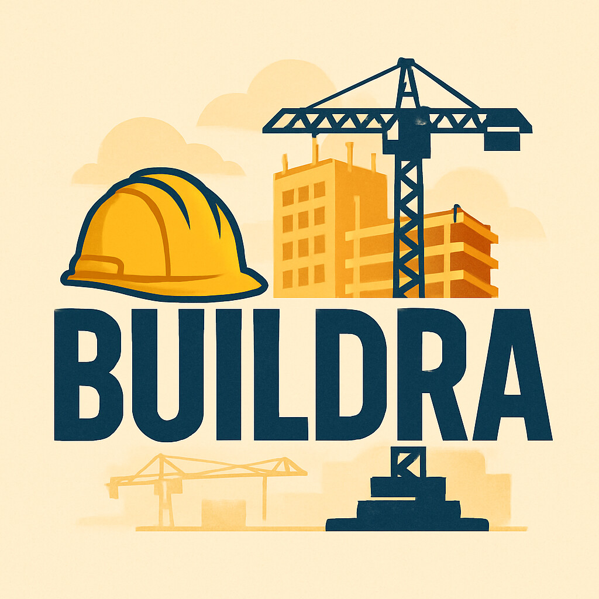

# Buildra pkgbuild

**Buildra** is a customizable Arch Linux ISO builder based on the [KIRO](https://github.com/kirodubes) project. It provides a simple way to build your own Arch-based installation medium with your choice of packages, settings, and scripts. Compare the configs and search for references like ArcoLinux, arcolinux, kiro, arconet and ArcoNet and change them to Buildra in this case. Use tools like rg (from ripgrep) and meld to compare.

## 🚀 Features

- Fully customizable build process
- Based on official Arch Linux tools and methodology
- GUI from https://github.com/calamares/calamares
- Script-driven: reproducible and automatable
- Modular structure for easy extension
- Lightweight and minimal by default

## 📦 Requirements

- Arch Linux or Arch-based system (for building)
- `archiso` package
- Basic familiarity with Bash scripting and package management
- Knowledge how to build ISOs - https://www.arcolinuxiso.com/a-comprehensive-guide-to-iso-building/
- The ULTIMATE video to build your ISO is here

